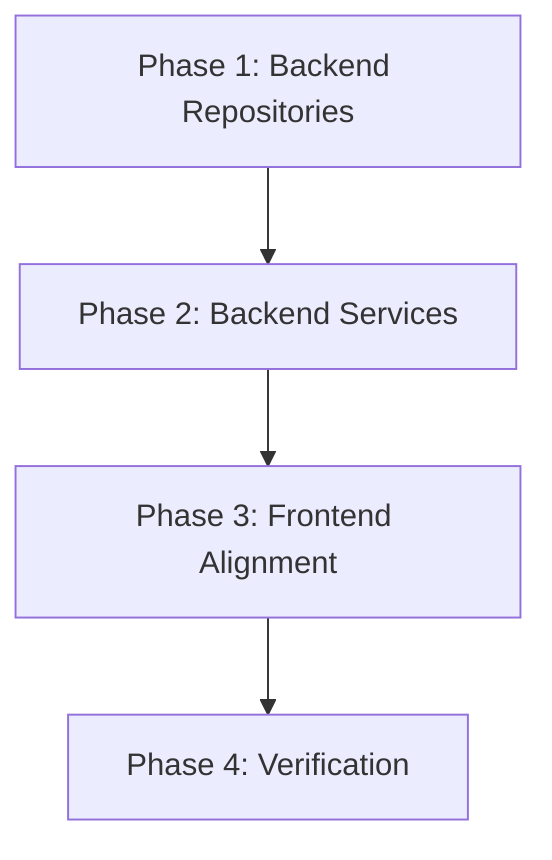

# Implementation Plan: Onboarding Reset & Balance Consistency

This plan addresses the issue where resetting onboarding fails to clear transaction history and causes balance inconsistencies between the Home and Transactions pages.

## 1. Plan Overview

- **Total Phases**: 4
- **Agents Involved**: Backend Engineer (coder), Frontend Engineer (coder), Tester (tester)
- **Estimated Effort**: Medium

## 2. Dependency Graph

## 3. Execution Strategy Table

| Stage | Agent | Mode | Description |
|-------|-------|------|-------------|
| 1 | Backend Engineer | Sequential | Add deletion and balance calculation queries to repositories. |
| 2 | Backend Engineer | Sequential | Update UserAccountService for full reset and transaction-led balance. |
| 3 | Frontend Engineer | Sequential | Align Transactions page balance display with the user profile. |
| 4 | Tester | Sequential | End-to-end verification of reset and consistency. |

## 4. Phase Details

### Phase 1: Backend Repositories

**Objective**: Add necessary data deletion and calculation methods to backend repositories.

- **Files to Modify**:
    - `backend/src/main/java/com/kaizen/backend/transaction/repository/TransactionRepository.java`: Add `void deleteByUserAccountId(Long userId)`.
    - `backend/src/main/java/com/kaizen/backend/category/repository/CategoryRepository.java`: Add `void deleteByUserId(Long userId)`.
    - `backend/src/main/java/com/kaizen/backend/payment/repository/PaymentMethodRepository.java`: Add `void deleteByUserAccountId(Long userId)`.

- **Implementation Details**:
    - Use `@Modifying` and `@Query` for deletion methods to ensure they are executed as single SQL statements for performance.
    - Ensure `TransactionRepository.calculateNetTransactionAmount` is tested or verified for accuracy.

- **Validation Criteria**:
    - Compile backend code.
    - (Optional) Unit test for `calculateNetTransactionAmount`.

- **Dependencies**: None.

### Phase 2: Backend Services

**Objective**: Update `UserAccountService` to implement the full reset logic and ensure the balance is always transaction-led.

- **Files to Modify**:
    - `backend/src/main/java/com/kaizen/backend/user/service/UserAccountService.java`:
        - Update `resetOnboarding`:
            - Call `transactionRepository.deleteByUserAccountId(account.getId())`.
            - Call `categoryRepository.deleteByUserId(account.getId())`.
            - Call `paymentMethodRepository.deleteByUserAccountId(account.getId())`.
            - Reset `balance` to 0.
        - Update `toUserResponse` and `toUserProfileResponse`:
            - Calculate balance using `transactionRepository.calculateNetTransactionAmount(account.getId())`.
            - Update `account.setBalance(calculatedBalance)` and save it (to keep the entity in sync for other services).

- **Implementation Details**:
    - Ensure `@Transactional` is correctly applied to `resetOnboarding`.
    - Handle `null` return from `calculateNetTransactionAmount` by defaulting to `BigDecimal.ZERO`.

- **Validation Criteria**:
    - Backend build passes.
    - API `/api/user/me` returns the correct sum of transactions as balance.

- **Dependencies**: Phase 1.

### Phase 3: Frontend Alignment

**Objective**: Ensure the Transactions page displays the same "Total Balance" as the Home page.

- **Files to Modify**:
    - `frontend/src/features/transactions/TransactionListPage.tsx`:
        - Remove `const balance = calculateRunningBalance(transactions)`.
        - Import `useAuthState` if not already present.
        - Use `user?.balance` from `useAuthState` for the "Total Balance" display.

- **Implementation Details**:
    - This ensures both pages (Home and Transactions) use the same cached value from the user profile, which is now transaction-led in the backend.

- **Validation Criteria**:
    - Frontend build passes.
    - Navigate between Home and Transactions pages and verify the "Total Balance" is identical.

- **Dependencies**: Phase 2.

### Phase 4: Verification

**Objective**: Verify the fix end-to-end.

- **Steps**:
    1. Log in and perform onboarding. Verify initial balance.
    2. Add several transactions (Income and Expense).
    3. Verify Home and Transactions pages show the same balance.
    4. Reset onboarding.
    5. Verify Transactions, Budgets, Categories, and Payment Methods are empty.
    6. Verify balance is 0.
    7. Re-onboard and verify only the new initial balance exists.

- **Validation Criteria**:
    - All success criteria from the design document are met.

- **Dependencies**: Phase 3.

## 5. File Inventory

| Phase | Path | Action | Purpose |
|-------|------|--------|---------|
| 1 | `backend/src/main/java/com/kaizen/backend/transaction/repository/TransactionRepository.java` | Modify | Add `deleteByUserAccountId`. |
| 1 | `backend/src/main/java/com/kaizen/backend/category/repository/CategoryRepository.java` | Modify | Add `deleteByUserId`. |
| 1 | `backend/src/main/java/com/kaizen/backend/payment/repository/PaymentMethodRepository.java` | Modify | Add `deleteByUserAccountId`. |
| 2 | `backend/src/main/java/com/kaizen/backend/user/service/UserAccountService.java` | Modify | Implement full reset and transaction-led balance. |
| 3 | `frontend/src/features/transactions/TransactionListPage.tsx` | Modify | Sync balance source with user profile. |

## 6. Risk Classification

- **Phase 1**: LOW — Simple repository additions.
- **Phase 2**: MEDIUM — Complex reset logic and potential foreign key risks.
- **Phase 3**: LOW — Minor frontend alignment.
- **Phase 4**: LOW — Verification steps.

## 7. Execution Profile

- Total phases: 4
- Parallelizable phases: 0
- Sequential-only phases: 4
- Estimated parallel wall time: N/A
- Estimated sequential wall time: 2 hours

## 8. Cost Estimation

| Phase | Agent | Model | Est. Input | Est. Output | Est. Cost |
|-------|-------|-------|-----------|------------|----------|
| 1 | coder | Flash | 2000 | 500 | $0.01 |
| 2 | coder | Flash | 3000 | 1000 | $0.02 |
| 3 | coder | Flash | 2000 | 500 | $0.01 |
| 4 | tester | Flash | 1000 | 200 | $0.01 |
| **Total** | | | **8000** | **2200** | **$0.05** |
