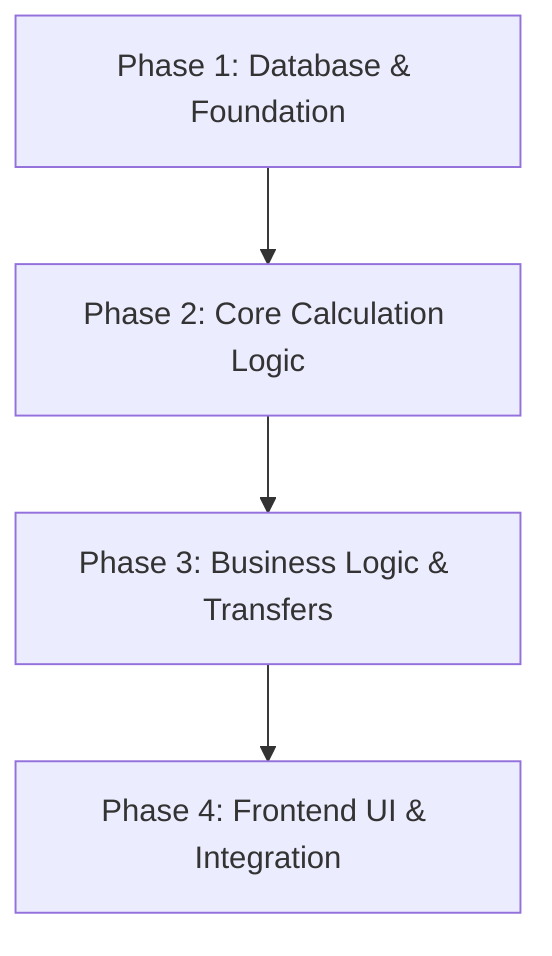

# Implementation Plan: Segmented Envelope Budget System

**Topic**: Budget Logic Fix & Period-Based Segmentation  
**Status**: Pending Approval  
**Date**: 2026-04-12  
**Task Complexity**: Medium  

## 1. Plan Overview
This plan decomposes the Segmented Envelope Budget System into 4 phases. It addresses the database schema, core calculation logic, business services, and the frontend user interface.

**Total Phases**: 4  
**Agents Involved**: `data_engineer`, `coder`, `code_reviewer`  
**Estimated Effort**: Medium (3-5 days)

## 2. Dependency Graph

## 3. Execution Strategy Table
| Stage | Phase | Agent | Mode | Parallel |
|-------|-------|-------|------|----------|
| Foundation | 1 | `data_engineer` | Sequential | No |
| Domain | 2 | `coder` | Sequential | No |
| Logic | 3 | `coder` | Sequential | No |
| UI/Integration | 4 | `coder` | Sequential | No |

## 4. Phase Details

### Phase 1: Database & Foundation
**Objective**: Update the database schema to support segmented allocation pools and concurrency control.

**Agent Assignment**: `data_engineer` (Rationale: Flyway migrations and JPA entity updates).

**Files to Create**:
*   `backend/src/main/resources/db/migration/V2__Add_Budget_Pools_And_Version.sql`: Add `available_monthly`, `available_weekly`, and `version` columns to `user_account`. Add `is_initial_injection_processed` flag.

**Files to Modify**:
*   `backend/src/main/java/com/kaizen/backend/user/entity/UserAccount.java`: Add fields for `availableMonthly`, `availableWeekly`, `isInitialInjectionProcessed`, and `@Version Long version`.
*   `backend/src/main/java/com/kaizen/backend/budget/dto/BudgetSummaryResponse.java`: Update record to include `availableMonthly` and `availableWeekly`.

**Validation Criteria**:
*   `./mvnw compile` (Check JPA mappings)
*   Check database schema in H2/PostgreSQL console.

---

### Phase 2: Core Calculation Logic
**Objective**: Implement date-range summing in `TransactionRepository` and `TransactionService`.

**Agent Assignment**: `coder` (Rationale: Implementation of core transaction summing logic).

**Files to Modify**:
*   `backend/src/main/java/com/kaizen/backend/transaction/repository/TransactionRepository.java`: Add `@Query` for summing expenses by category and date range. Add `@Query` for summing income by date range.
*   `backend/src/main/java/com/kaizen/backend/transaction/service/TransactionService.java`: Refactor `recalculateBudgetExpenses` to use `java.time` with calendar-aligned boundaries (UTC). Implement `calculatePeriodicIncome`.

**Implementation Details**:
*   Use `LocalDate.now(ZoneOffset.UTC)` for current date.
*   For `MONTHLY`: `date.with(TemporalAdjusters.firstDayOfMonth())` to `date.with(TemporalAdjusters.lastDayOfMonth())`.
*   For `WEEKLY`: `date.with(TemporalAdjusters.previousOrSame(DayOfWeek.MONDAY))` to `date.with(TemporalAdjusters.nextOrSame(DayOfWeek.SUNDAY))`.

**Validation Criteria**:
*   `./mvnw test` (Targeted tests for TransactionService summing)

---

### Phase 3: Business Logic & Transfers
**Objective**: Implement allocation, rollover, and transfer logic in `BudgetService`.

**Agent Assignment**: `coder` (Rationale: Complex business logic for transfers and rollovers).

**Files to Modify**:
*   `backend/src/main/java/com/kaizen/backend/budget/service/BudgetService.java`: 
    *   Update `buildBudgetSummary` to calculate "Available to Allocate" using pool balances.
    *   Implement `transferFunds(email, sourcePeriod, targetPeriod, amount)`.
    *   Implement `processRollover(user)` logic (to be called via a scheduled task or on first login of a new period).
    *   Implement `processInitialInjection(user)` during first budget setup.

**Validation Criteria**:
*   Unit tests for `transferFunds` (validating insufficient funds and atomic updates).
*   Unit tests for `processRollover` covering surplus and debt scenarios.

---

### Phase 4: Frontend UI & Integration
**Objective**: Update the budget dashboard and detail views with segmented health and the transfer modal.

**Agent Assignment**: `coder` (Rationale: Frontend component development and API integration).

**Files to Create**:
*   `frontend/src/features/budgets/components/TransferFundsModal.tsx`: Modal to move money between Monthly and Weekly pools.

**Files to Modify**:
*   `frontend/src/features/budgets/pages/BudgetsPage.tsx`: Display separate health status for Weekly and Monthly pools.
*   `frontend/src/features/budgets/pages/BudgetDetailPage.tsx`: Dynamic labels ("Weekly Budget" vs "Monthly Budget").
*   `frontend/src/features/budgets/components/AllocationTotalDisplay.tsx`: Update to show segmented availability.

**Validation Criteria**:
*   `npm run lint`
*   Manual verification of "Weekly" vs "Monthly" labels.
*   Manual verification of fund transfers between pools.

## 5. File Inventory
| Action | Path | Phase | Purpose |
|--------|------|-------|---------|
| Create | `backend/src/main/resources/db/migration/V2__Add_Budget_Pools_And_Version.sql` | 1 | Schema update for pools and versioning. |
| Modify | `backend/src/main/java/com/kaizen/backend/user/entity/UserAccount.java` | 1 | Add pool fields and @Version. |
| Modify | `backend/src/main/java/com/kaizen/backend/transaction/repository/TransactionRepository.java` | 2 | Add date-range summing queries. |
| Modify | `backend/src/main/java/com/kaizen/backend/transaction/service/TransactionService.java` | 2 | Update summing logic with UTC date ranges. |
| Modify | `backend/src/main/java/com/kaizen/backend/budget/service/BudgetService.java` | 3 | Implement transfers, rollovers, and summary logic. |
| Create | `frontend/src/features/budgets/components/TransferFundsModal.tsx` | 4 | UI for moving money between pools. |
| Modify | `frontend/src/features/budgets/pages/BudgetsPage.tsx` | 4 | Segmented health dashboard. |

## 6. Risk Classification
| Phase | Risk | Rationale |
|-------|------|-----------|
| 1 | LOW | Standard schema changes. |
| 2 | MEDIUM | Date logic edge cases (timezone boundaries, leap years). |
| 3 | HIGH | Concurrency and state synchronization between pools. |
| 4 | MEDIUM | UI state management for multiple balance pools. |

## 7. Execution Profile
- Total phases: 4
- Parallelizable phases: 0 (Strict sequential dependency on schema and logic)
- Sequential-only phases: 4
- Estimated sequential wall time: 3-5 days

## 8. Cost Estimation
| Phase | Agent | Model | Est. Input | Est. Output | Est. Cost |
|-------|-------|-------|-----------|------------|----------|
| 1 | `data_engineer` | Flash | 5K | 1K | $0.02 |
| 2 | `coder` | Flash | 15K | 3K | $0.05 |
| 3 | `coder` | Flash | 20K | 5K | $0.10 |
| 4 | `coder` | Flash | 25K | 8K | $0.15 |
| **Total** | | | **65K** | **17K** | **$0.32** |
